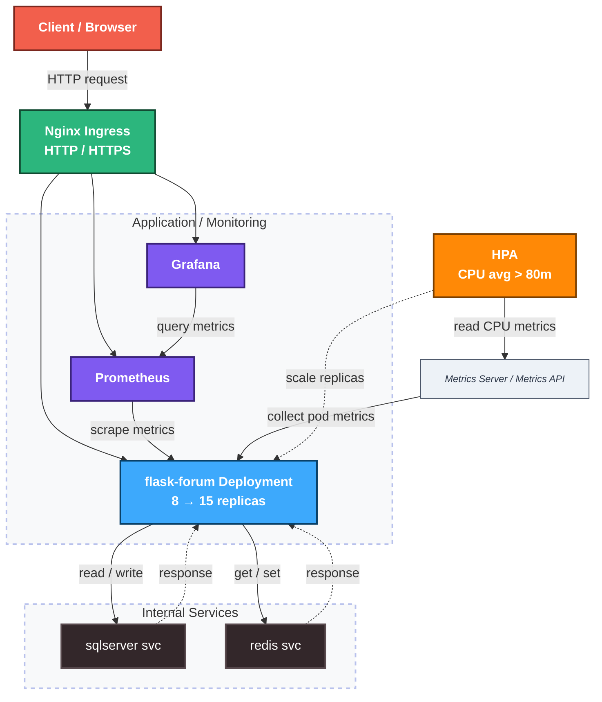

# Forum Web Deployment

Deploy một ứng dụng forum Flask lên Kubernetes, với đầy đủ autoscaling, monitoring và CI/CD. Repo này cover toàn bộ phần infrastructure và deployment — từ Docker Compose cho dev đến K8s cho production-like environment.

    


---

## Kiến trúc


 
```
HPA: 8 → 15 replicas (trigger: CPU avg > 80m)
```

---

## Cấu trúc thư mục

```
.
├── App.py
├── Docker
│   ├── Nginx.conf
│   ├── auth_routes.py
│   ├── deploy_docker_compose.sh
│   ├── docker-compose.yaml
│   ├── monitoring-compose.yaml
│   └── prometheus.yml
├── Dockerfile
├── ForumWEB.sql
├── K6 Peformance Testing
│   ├── k61-login-route.js
│   ├── k62-homepage.js
│   ├── k63.js
│   └── k64-compose.js
├── K8S
│   ├── Deploy_forum_app_stacks_k8s.yaml
│   ├── Deploy_k8s.sh
│   ├── alertmanager-values.yaml
│   ├── grafana_values.yaml
│   └── k8s_allert.yaml
├── README.md
├── Các file ứng dụng
7 directories, 29 files

```

---

## Điểm thiết kế đáng chú ý

**Multi-stage Dockerfile**
Build stage cài compiler toolchain để compile `pyodbc`. Runtime stage chỉ copy `/opt/venv` sang — không có `gcc`, `g++` hay build deps trong image production. Giảm attack surface và image size đáng kể.

**Network isolation trong Docker Compose**
Tách `frontend_network` và `backend_network`. Nginx chỉ thấy Flask, Flask mới thấy SQL Server và Redis. Database không bao giờ expose ra ngoài.

**HPA scale up tức thì, scale down chậm**
`stabilizationWindowSeconds: 0` cho scale up — pod mới tạo ngay khi CPU vượt ngưỡng, không chờ. Scale down giữ window 60s để tránh pod bị thu hồi rồi lại phải tạo lại khi traffic chỉ giảm tạm thời.

**Automation script end-to-end**
`Deploy_k8s.sh` xử lý toàn bộ: apply manifests → wait pods ready → inject SQL seed data.

---

## Yêu cầu

- Docker
- kubectl, helm
- File `.env` 
```
ACCEPT_EULA=Y
MSSQL_SA_PASSWORD=YourStrongPassword123!
REDIS_HOST=redis
DB_SERVER=sqlserver
DB_NAME=ForumWEB
DB_USER=sa
DB_PASSWORD=YourStrongPassword123!
FLASK_SECRET_KEY=supersecretkeyandhardtoguess
```
---

## Cách chạy

### Docker Compose (dev/test)

```bash
chmod +x Docker/deploy_docker_compose.sh
./Docker/deploy_docker_compose.sh
```

### Kubernetes

```bash
chmod +x K8S/Deploy_k8s.sh
./K8S/Deploy_k8s.sh
```


---

## Performance testing
> Thực hiện trên cluster (AWS EC2, 3 worker nodes). Kết quả phản ánh hiệu năng thực tế của hạ tầng.

Script `K6 Peformance Testing/k64-compose.js` dùng k6, mô phỏng tải hỗn hợp bằng `scenarios` gồm 2 luồng chạy song song:
- **`guest_browsing`** (read-heavy): ramping-vus tăng dần lên 800 VUs, chỉ GET trang chủ `/`.
- **`user_login`** (write-heavy): ramping-vus tăng dần lên 200 VUs, mỗi VU thực hiện GET `/login` → parse CSRF token → POST đăng nhập. Bước lấy CSRF token là bắt buộc vì Flask bật CSRF protection — request thiếu token bị từ chối ngay (xem chi tiết trong file).

Mỗi request được gắn `tags: { name: ... }` (`GET_Homepage`, `GET_Login_Page`, `POST_Login_Submit`) để k6 bóc tách latency riêng theo từng endpoint, kèm threshold riêng cho từng loại:

```
scenarios: {
  guest_browsing: {
    executor: 'ramping-vus',
    stages: [
      { duration: '30s', target: 800 },
      { duration: '1m', target: 800 },
      { duration: '30s', target: 0 },
    ],
    exec: 'browsingFlow',
  },
  user_login: {
    executor: 'ramping-vus',
    stages: [
      { duration: '30s', target: 200 },
      { duration: '1m', target: 200 },
      { duration: '30s', target: 0 },
    ],
    exec: 'loginFlow',
  },
},
thresholds: {
  http_req_failed: ['rate<0.01'],
  'http_req_duration{name:GET_Homepage}': ['p(95)<1000'],
  'http_req_duration{name:GET_Login_Page}': ['p(95)<1500'],
  'http_req_duration{name:POST_Login_Submit}': ['p(95)<3000'],
},
```

```bash
k6 run k64-compose.js
```

### Kết quả tổng hợp

| Chỉ số | Giá trị |
|---|---|
| Tổng requests | 51,756 (424.2 req/s) |
| Iterations hoàn thành | 40,378 (330.9 iter/s) |
| Avg latency (chung) | 89.89ms |
| p90 latency (chung) | 96.29ms |
| p95 latency (chung) | 114.62ms |
| Max latency | 3.73s |
| Error rate | 0.00% (0/51,756) |
| Checks | 100.00% (46,067/46,067) |

### Latency theo từng endpoint

| Endpoint | Avg | p90 | p95 | Max |
|---|---|---|---|---|
| GET_Homepage | 98.41ms | 100.89ms | 122.42ms | 3.73s |
| GET_Login_Page | 56.41ms | 51.36ms | 63.91ms | 3.35s |
| POST_Login_Submit | 80.63ms | 90.04ms | 104.2ms | 3.67s |

Cả 3 threshold per-endpoint đều pass (p95 GET_Homepage < 1s, GET_Login_Page < 1.5s, POST_Login_Submit < 3s), dù max latency cá biệt vọt lên hơn 3s trong lúc HPA đang scale — không đủ để kéo p95 vượt ngưỡng.

### Quan sát HPA trong quá trình test

HPA cấu hình `min 8 / max 15` pods, target CPU 80%. Idle ban đầu CPU chỉ ~1%. Khi k6 bắt đầu bắn tải kết hợp (800 VUs browsing + 200 VUs login), CPU tăng nhanh: 35% → 127% → đỉnh 207%, HPA phản ứng scale từ 8 → 13 → 15 pods (chạm max pods cấu hình). Sau khi giữ tải ổn định, CPU hạ dần về vùng 108–125% rồi rớt nhanh khi k6 ramp-down.

Sau khi tải kết thúc, CPU về gần 1% nhưng HPA vẫn giữ nguyên 15 pods trong một khoảng thời gian (cooldown window) trước khi scale down dần 15 → 10 → 8 pods, tránh scale down non khi traffic chỉ giảm tạm thời:

```
NAME              REFERENCE                TARGETS        MINPODS   MAXPODS   REPLICAS
flask-forum-hpa   Deployment/flask-forum   cpu: 1%/80%    8         15        8
flask-forum-hpa   Deployment/flask-forum   cpu: 35%/80%   8         15        8
flask-forum-hpa   Deployment/flask-forum   cpu: 127%/80%  8         15        8
flask-forum-hpa   Deployment/flask-forum   cpu: 207%/80%  8         15        13
flask-forum-hpa   Deployment/flask-forum   cpu: 139%/80%  8         15        15
flask-forum-hpa   Deployment/flask-forum   cpu: 125%/80%  8         15        15
flask-forum-hpa   Deployment/flask-forum   cpu: 123%/80%  8         15        15
flask-forum-hpa   Deployment/flask-forum   cpu: 108%/80%  8         15        15
flask-forum-hpa   Deployment/flask-forum   cpu: 49%/80%   8         15        15
flask-forum-hpa   Deployment/flask-forum   cpu: 12%/80%   8         15        15
flask-forum-hpa   Deployment/flask-forum   cpu: 1%/80%    8         15        15
flask-forum-hpa   Deployment/flask-forum   cpu: 1%/80%    8         15        15
flask-forum-hpa   Deployment/flask-forum   cpu: 1%/80%    8         15        10
flask-forum-hpa   Deployment/flask-forum   cpu: 1%/80%    8         15        8
```

```
http_req_duration: avg=89.89ms  p(90)=96.29ms  p(95)=114.62ms  max=3.73s
http_req_failed:   0.00%  (0 / 51756 requests)
iterations:        40378  (330.9/s)
checks:            100.00% (46067 / 46067)
```